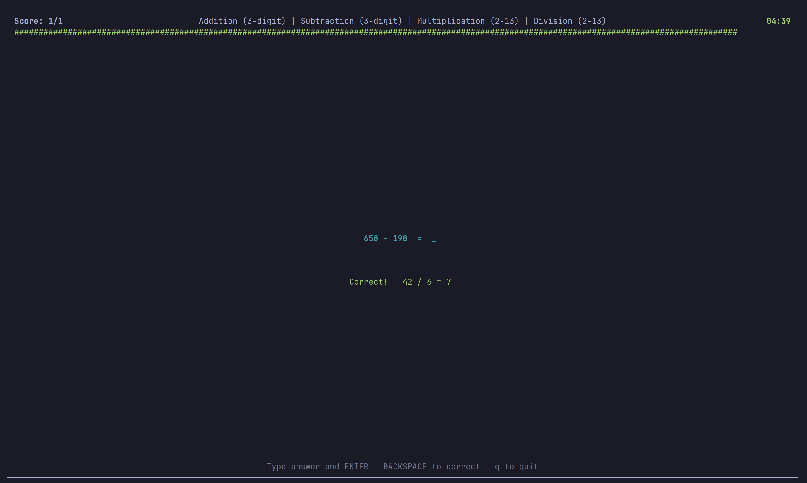

<h1 align="center">Mental Maths</h1>



A terminal arithmetic trainer with a countdown timer. Practice addition, subtraction, multiplication, and division — optionally using your voice.

## Installation

Install system and python dependencies:

```
sudo apt install portaudio19-dev
uv sync
```

## Usage

```
uv run python -m mentalmaths
```

## Voice mode

Voice mode uses [Vosk](https://alphacephei.com/vosk/) for fully offline speech recognition. A model must be downloaded separately:

```
mkdir -p ~/.local/share/mental-maths
cd ~/.local/share/mental-maths
wget https://alphacephei.com/vosk/models/vosk-model-en-us-0.22-lgraph.zip
unzip vosk-model-en-us-0.22-lgraph.zip
mv vosk-model-en-us-0.22-lgraph vosk-model
rm vosk-model-en-us-0.22-lgraph.zip
```

Enable voice mode from the main menu by pressing `s`. Speak your answer followed by "enter" to submit (e.g. *"forty two enter"*). Say "no" at any point to clear the current entry.

## Development

Run tests:

```
uv run pytest tests/
```

## License
This project is published under an [MIT](https://github.com/jkennedy-dev/mental-maths/blob/dev/LICENSE) license.
